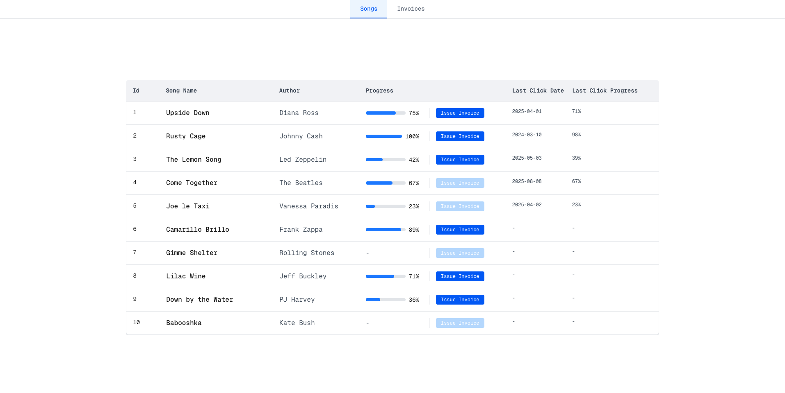
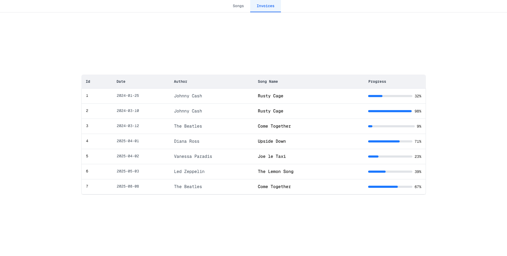

# Royalty Processing

A Next.js & TypeScript app powered by TanStack Query for managing song royalties and invoices.

<p align="center">
  
  
</p>

## Running the Application

### Prerequisites

- Node.js v20.x

### Install Dependencies

```bash
pnpm install
# or npm install
```

### Production Build & Start (recommended due to Next.js prefetch)

```bash
pnpm clean:start
# or npm run clean:start
```

### Development Mode

```bash
pnpm dev:clean
# or npm run dev:clean
```

Open http://localhost:3000 in your browser to view the app.

## Features

- Display a list of songs with royalty information, plus generate and view invoices.

- Optimized data fetching, caching, and mutations — **TanStack Query** ⚡ .

  On first visits, users see a loading skeleton while data loads from the server. Returning visits are lightning-fast thanks to cached data, with background refetching keeping content up to date. After a successful POST request, the song’s “last click” info updates immediately without waiting for the server response (optimistic update approach could also be implemented). Additionally, invoice data is marked as stale after updates, ensuring the next time the invoice page is visited, fresh data is fetched seamlessly in the background.

- Page prefetching for seamless client-side navigation (enabled only in production builds).

- Windows focus refetching - automatic background refetch when the app regains focus.

- API routes with automatic database seeding during initialization.

## Design Choices

- **Next.js:** powerful React framework supporting SSR, ISR, and client-only rendering, making it a highly scalable and flexible solution. For this Royalty Processing application, SSR and ISR prototypes were initially explored but overall complexity outweighed the benefits for this context. Instead, a client-only approach was choosen, supercharged by TanStack Query.

  Bonus: Next.js offers API Routes out of the box, so building a simple “songs and invoices” API was a no-brainer.

- **TanStack Query** – a server-state library (as opposed to client-state libraries such as Redux), responsible for managing asynchronous operations between the server and the client. In general, application state can be grouped into two categories:

  - Server Cache – state that is actually stored on the server but cached on the client for quick access.
  - UI State – state that exists only in the UI to control interactive elements.

  These two types of state have inherently different problems and therefore should be managed differently. For this application, the UI is very simple and the state is almost non-existent - the focus is on server-provided data (the source of truth). This made choosing a server-state library a straightforward decision. Note that TanStack Query and Redux can be used together, or Redux Toolkit Query (RTK) could be adopted as an alternative server-state solution.

- **Tailwind CSS:** widely adopted utility-first CSS framework. It allowed for rapid styling without heavy design overhead, making it ideal for quick iteration in this project.

- **SQLite3:** ultra-lightweight database stored as a local file—perfect for early proof-of-concepts. It requires zero external dependencies, works instantly in local environments and can be migrated to Postgres or MySQL offering nice scalability for a PoC.

  Caveat: Vercel (Next.js frontend cloud) deployments don’t support SQLite because it relies on a persistent local file system to store data. Serverless functions use ephemeral storage, meaning any files written during a function’s execution disappear afterward.

- **Jest + React Testing Library:** proven combination for unit testing in React projects.

## Project Structure In a Nutshell

```
.
├── src/
│   ├── components/       # UI components
│   ├── hooks/            # React hooks for State Management + Data Querying
    ├── pages/            # Next.js pages & API routes
│   │   ├── api/          # REST API handlers (songs, invoices)
│   │   ├── invoices/     # Invoice page
│   │   ├── songs/        # Songs page
│   │   ├── error/        # Generic error page
│   ├── repository/       # Data layer: DB connection, queries, seed logic
```
